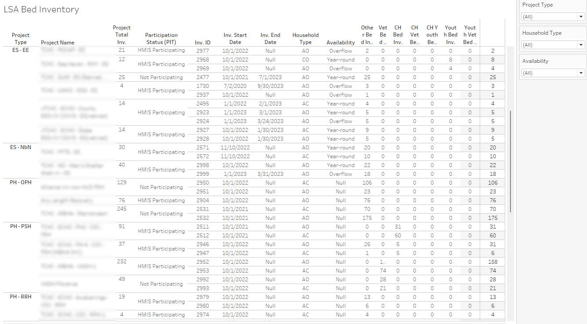

# hud-hmis-lsa-bed-counts-tableau
Uses your HUD LSA export to see bed counts in Tableau.

You will need to take your LSA Export and combine the sheets in Excel.  The required sheets must be named "Project", "HMISParticipation", "Inventory", and "Organization".

To use this you can either: 

* Create an Excel woorkbook and add each of the CSVs as a sheet

*OR* 

* Use the csv-zip-to-excel.py to do the work for you.

  * To use the python script make sure you have python, pandas, and openpyxl installed.
    * Python 3.9+ should work and can be downloaded here if you don't already have it - https://www.python.org/downloads/
    * Once Python is installed you can install pandas and openpyxl use `pip install pandas openpyxl` from the command line.  If Python wasn't added to your path you may need to add the full path to python before the pip command. If Python was added to your PATH you may need to log off and log back in.
    * To create your xlsx from the zip file use `python csv-zip-to-excel.py c:\path_to_your_export\export_file.zip`  If there are spaces in the path you will need to surround them by quotes.
   
Once you have your XLSX file you can then open the Tableau workbook and choose the XLSX file for the data source!

